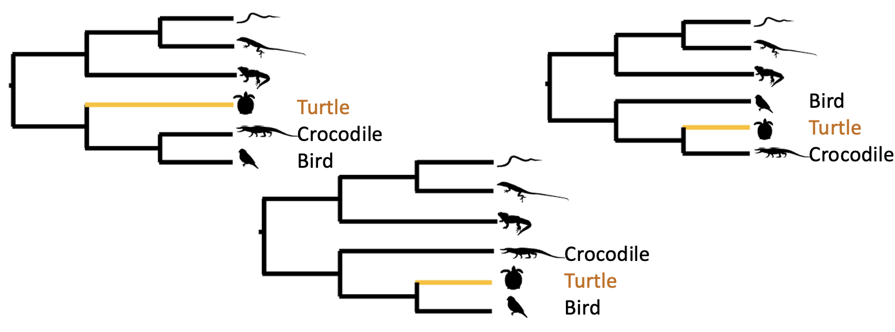
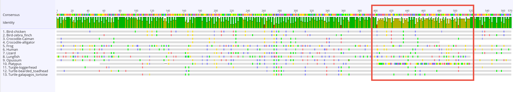

# **Alignment basics**

Remember that the point of alignment is to arrange homologous sequences in such a way that you are willing to accept that each *column*:

-   represents a site that was present in the ancestor of all the sampled taxa
-   was inherited vertically to all of the sequences in your alignment, perhaps with modification (i.e. substitutions)

In practice alignment is very hard, and there's rarely a 'right' answer for empirical data. Widely accepted practice is:

1.  Start with unaligned sequences that you *think* are homologous
2.  Align them with software (e.g. with `MAFFT`)
3.  Check your alignments by eye or with software to catch any problems
4.  Return to step 2 until you are happy with the alignment

In my opinion, by far the most important thing is that you check ***by eye*** every alignment you will use for inference. There are many software tools that can help check and trim alignments too, but they are beyond the scope of this workshop.

# **Getting set up**

First, make a new directory wherever you like to keep stuff on your computer, and call it "Workshop". Inside that directory, make another directory called "Alignment".

Now use your command line (terminal on Mac, Ubuntu on Windows) to navigate to that directory using the `cd` command.

An example on a Mac might look a bit like this:

```{bash, eval=FALSE}
cd /Users/rob/Documents/Workshop/Alignment 
```

and on Windows it might look like this

```{bash, eval=FALSE}
cd /mnt/c/Users/rob/Documents/Workshop/Alignment
```

Next, download the raw data for this workshop. To do that:

1.  Go to this link: <https://github.com/roblanf/Workshop-MIG>
2.  Click the `raw_data.zip` file
3.  Click the `download raw file` button (see below!) and save it to your computer
4.  Unzip the file, and put it into your 'Workshop' folder
5.  Inside the `1_locus` folder, copy the file `turtle_ENSGALG00000005902.unaligned.fasta` into your `Alignment` folder


# **Look at the unaligned sequences**

The file `turtle_ENSGALG00000005902.unaligned.fasta` contains sequences from the genomes of a range of vertebrates. The bioinformatic pipeline used to get these sequences was satisfied that they were all homologuos to each other - i.e. the are all copies of a sequence that existed in the ancestor of these species, and was inherited vertically (with modification) into the species we've included in our analysis.

Open the file in Sublime Text, and try dragging and dropping it into Geneious too. Both can be useful ways to look at the initial sequences.

What do you notice about the unaligned sequences? Do some of them look similar? Do any look different? Are they similar lengths?

**Tip**: You can open an entire folder with Sublime Text. Try dragging and dropping the whole Workshop folder into Sublime. This allows you to easily navigate through the folder as things change. You can also keep multiple tabs open - just double click a file in the drop down menu to the side and it will stay open.

# **Alignment using MAFFT**

Aligning these sequences is very simple. 

Activate your conda `phylo` environment as follows:

```{bash, eval=FALSE}
conda activate phylo
```

> Remember that the start of your command line should say '(phylo)' if this worked!

Making sure that you're inside the `Alignment` folder, double check that the `turtle_ENSGALG00000005902.unaligned.fasta` file is present using the list command:

```{bash, eval=FALSE}
ls
```


**Tip**: Unix has tab completion, which is really useful if you're typing commands. Tab completion will try to complete a command for you if you hit tab. If it's ambiguous, it will show you the options. Type the start of any command or file name (e.g. `turt` is the start of the long filename in the command below) than press TAB - Unix will complete the filename for you because it's the only thing that starts with `turt`. 

Align the sequences with MAFFT like this:

```{bash, eval=FALSE}
mafft turtle_ENSGALG00000005902.unaligned.fasta > aligned_seqs.fasta
```

This will create a new file called `aligned_seqs.fasta`, in this file, MAFFT has aligned the sequences to one another as best it can.

Let's break this command down:

* `mafft`: just calls mafft, which expects the next command to be the input sequence file
* `>`: is a 'pipe'. By default, a lot of Unix programs (including MAFFT) send their output to the screen. The `>` sends to to where you tell it, which in this case is to a new file called `aligned_seqs.fasta`. If you run the command without the pipe, i.e. `mafft turtle_ENSGALG00000005902.unaligned.fasta` you'll see the output just appears on screen, and is not saved anywhere.

# **Checking the alignment**

MAFFT has now aligned your sequences, but it's crucial to check the alignment by eye. Open the alignment file (`aligned_seqs.fasta`) in Sublime Text and in Geneious. What do you notice?

You should see that most of the sequences have aligned well, but one has not. This is very common! Bioinformatic pipelines are always imperfect, and in this case a non-homologous sequence has crept in from somewhere.

A good sanity check on any alignment is to build a phylogeny of the sequences. Geneious lets you do this very easily. In Geneious, with the alignment highlighted:

1.  Click the 'Tree' button at the top
2.  Click 'OK'

This will build a simple but useful tree using a clustering method called Neighbour Joining. What do you notice?

What you should see is that the sequence that aligned poorly sticks out on a VERY long branch. This is a classic diagnostic of a non-homologous sequence. Branch lengths in these analyses are measured in substitutions per site. This branch length is close to 1.0, meaning that on average every site in the alignment has about one change required to fit it onto the tree. When branch lengths get close to (or above) 1.0, phylogenetic methods tend to struggle. 

The solution here is to remove the poorly-aligned sequence from the `turtle_ENSGALG00000005902.unaligned.fasta` file, and then repeat the alignment.

# **Realignment**

## Remove the bad sequence

Let's remove the bad sequence and try again.

1.  Copy the `turtle_ENSGALG00000005902.unaligned.fasta` file, and save the new copy as `turtle_ENSGALG00000005902.unaligned.cleaned.fasta`
2.  Open the `turtle_ENSGALG00000005902.unaligned.cleaned.fasta` file in Sublime text
3.  Delete the name and sequence (the name is on a line starting with `>`, the sequence follows) of the offending sequence, then save the file

Notice that it's common in bioinformatics to have long file names, which describe what has been done to a file

## Realign the cleaned sequence file

Now we can try the alignment again and see if removing the bad sequence has improved it.

Go back to your command line, and run MAFFT on the new file like this (try Tab completion on the long filename):

```{bash, eval=FALSE}
mafft turtle_ENSGALG00000005902.unaligned.cleaned.fasta > aligned_seqs_cleaned.fasta
```

Load the resulting file into Geneious, zoom into the alignment and check it visually. What do you notice?

Finally, build a tree from the alignment using Geneious. If the tree and the alignment look sensible, you're done!

# **Back to biology...**

Although the way that Geneious builds trees uses a very simple clustering method called Neighbour Joining, these trees are still useful and can be reliable.

The gene you've aligned comes from a dataset designed to figure out where turtles sit in the tree of life. The three widely accepted options (at least, about decade ago) were that turtles were one of:

1.  The sister group to birds

2.  The sister group to crocodiles

3.  The sister group to (birds + crocodiles)



What does your single-gene phylogeny say? If it differs from these, why could that be?

Do you notice anything else? Where does the Lizard group? Is this what you'd expect? 

# **Going further**

If you get to this point before the end of the session, try comparing your alignment of this locus to the alignment that was used in the original paper. You can find this in the `raw_data/29_loci` folder, in the file `turtle_ENSGALG00000005902.macse_DNA_gb-out.fasta`. Open this in Geneious, then compare it visually to your alignment of the same sequences. Also build a tree in Geneious and compare the trees.

You should notice that the alignments and trees differ. It looks like there's a tricky part of the alignment from around 400-500bp in the orignal file (highlighted in the box below). The original paper used MASCE to align sequences. MAFFT (which we used) aligned this region differently. If you examine the trees of the two alignments, you should see that the Platypus is placed subtly differently in each.\
\
If we were being picky, we might edit out this part of the Platypus sequence, because it's hard to be sure that the bases in that region are homologous to the rest of the alignment. I would certainly recommend this if the focus of the study was anything to do with the Platypus.\


