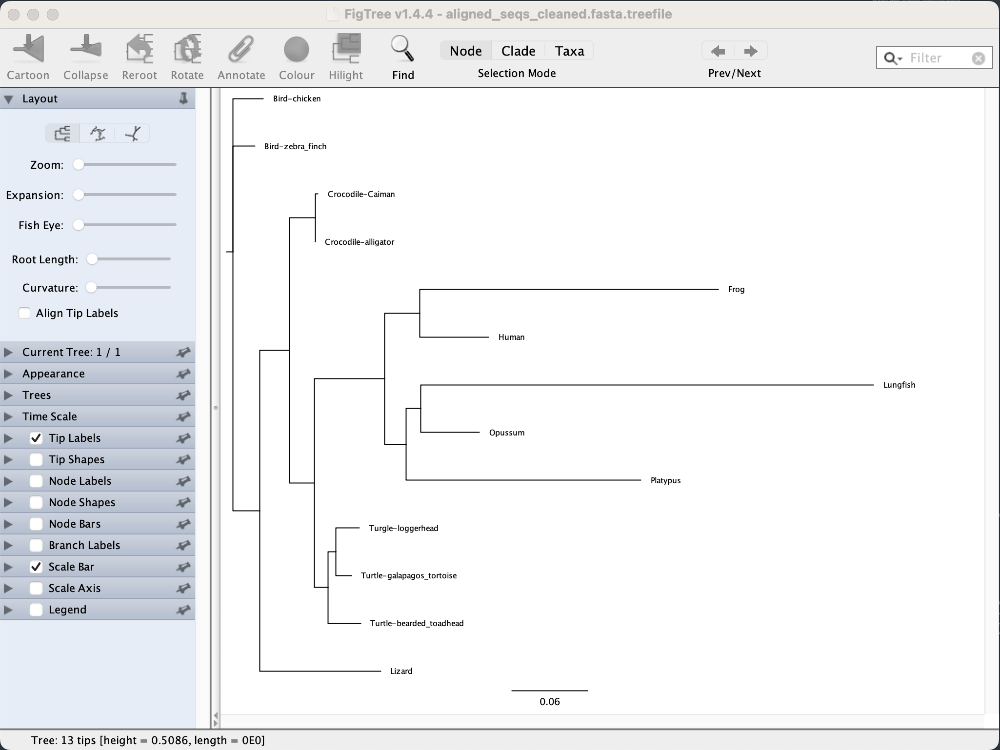
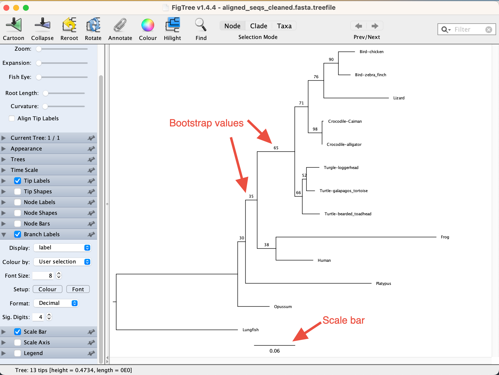

# **Introduction**

In this practical we'll run IQ-TREE to estimate Maximum Likelihood trees of our data. IQ-TREE is a widely-used piece of software that uses alignments to infer phylogenetic trees.

# **Getting set up**

Inside the `Workshop` folder on your computer, make a new folder called `IQTREE_basics`.

> Tip: note that we never have spaces in file or folder names. This is intentional --- spaces can be problematic in Unix.

Now use your command line (terminal on Mac/Linux, Ubuntu on Windows) to navigate to that directory using the `cd` command.

An example on a Mac might look a bit like this:

```{bash, eval=FALSE}
cd /Users/rob/Documents/Workshop/IQTREE_basics 
```

and on Windows it might look like this:

```{bash, eval=FALSE}
cd /mnt/c/Users/rob/Documents/Workshop/IQTREE_basics
```

Finally, we'll copy the alignment we made in the previous session into this folder. You can do this as you usually would on your computer, by just copying the `aligned_seqs_cleaned.fasta` from the `Alignment` folder into the `IQTREE_basics` folder.

Or you can use the command line like this:

```{bash, eval=FALSE}
cp ../Alignment/aligned_seqs_cleaned.fasta .
```

-   `cd` changes directory into the `1_locus` folder
-   `cp` is copying the file we need (`../` goes up a level in the directories), into the current location (the `.`)

Either way, once you're done you should be to check that the file is there by using the `ls` command like this:

```{bash, eval=FALSE}
ls -lh
```

* Adding `-lh` makes the output a bit easier to read, and more informative

You should see something like this:

```
-rw-r--r--  1 roblanfear  staff   7.9K 15 Sep 10:01 aligned_seqs_cleaned.fasta
```


# **IQ-TREE 101**

## A basic command line

Now we'll use IQ-TREE to estimate a tree from our alignment. IQ-TREE is built so that (as far as possible) the default settings should do sensible and useful things.

First we'll estimate a tree of the single locus we aligned before. To do this, we can run IQ-TREE on that alignment as follows, using the simplest possible command line:

```{bash, eval=FALSE}
iqtree -s aligned_seqs_cleaned.fasta
```

In this commandline, we simply call the `iqtree` program, and point it to our alignment file using the `-s aligned_seqs_cleaned.fasta` argument.

Once you hit Return, a lot of things start happening in the background. IQ-TREE loads the sequences and checks the alignment, it guesses what type of data it is (DNA in this case), it chooses a best-fit model of evolution from hundreds of options, then it looks for the best tree while optimising the model parameters and the branch lengths.

## IQ-TREE output

At the end of the run, IQ-TREE will print this:

```         
Analysis results written to: 
  IQ-TREE report:                aligned_seqs_cleaned.fasta.iqtree
  Maximum-likelihood tree:       aligned_seqs_cleaned.fasta.treefile
  Likelihood distances:          aligned_seqs_cleaned.fasta.mldist
  Screen log file:               aligned_seqs_cleaned.fasta.log
```

The two most important files are the `.iqtree` file and the `.treefile` file.

Open up the `.iqtree` file and scan through it. You should see that IQ-TREE has chosen the `TNe+G4` model of evolution. This is the Tamura-Nei model of evolution with a 4-category discrete gamma rate variation, which is a relatively simple model of evolution.

As you continue to scan through the file, you'll see the Maximum Likelihood model parameters printed, and then some information about the tree and a schematic of the tree, which looks like this:

```         
NOTE: Tree is UNROOTED although outgroup taxon 'Bird-chicken' is drawn at root

+--Bird-chicken
|
+--Bird-zebra_finch
|
|        +--Crocodile-Caiman
|     +--|
|     |  +**Crocodile-alligator
|  +--|
|  |  |           +--------------------------Frog
|  |  |        +--|
|  |  |        |  +-----Human
|  |  |  +-----|
|  |  |  |     |     +-----------------------------------------Lungfish
|  |  |  |     |  +--|
|  |  |  |     |  |  +----Opussum
|  |  |  |     +--|
|  |  |  |        +--------------------Platypus
|  |  +--|
|  |     |     +--Turgle-loggerhead
|  |     |  +--|
|  |     |  |  +--Turtle-galapagos_tortoise
|  |     +--|
|  |        +--Turtle-bearded_toadhead
+--|
   +----------Lizard
```

# **Bootstraps**

Bootstrapping is a way of estimating the sampling variance for each branch in the tree. The higher the bootstrap percentage, the more certain we are that a branch in a tree was supported by a lot of data in the alignment. We'll discuss bootstraps more after lunch, but now's a good time to try them out.

To re-do our analysis as above, but adding bootstraps, we can do this:

```{bash, eval=FALSE}
iqtree -s aligned_seqs_cleaned.fasta -b 100 -redo
```

Breaking down the command line:

* `-b 100` tells IQ-TREE to do 100 bootstraps
* `-redo` make it perform both model selection and tree finding every time

What IQ-TREE does here is:

-   The same analysis as before
-   100 new analyses, where in each one it creates a replicate dataset by resampling the original, and then analyses those datasets from scratch. Typically, 100 is the smallest number of bootstraps you would do.

This may take a minute or two to run, because now IQ-TREE is doing 101 anlayses.

When it's done, if you open up the `.iqtree` file, it should look pretty similar. You should see that the same model `TNe+G4` was chosen for example. But when you get to the tree it should now have bootstrap percentages on the nodes:

```         

+--Bird-chicken
|
+--Bird-zebra_finch
|
|        +--Crocodile-Caiman
|     +--| (98)
|     |  +**Crocodile-alligator
|  +--| (76)
|  |  |           +--------------------------Frog
|  |  |        +--| (38)
|  |  |        |  +-----Human
|  |  |  +-----| (65)
|  |  |  |     |     +-----------------------------------------Lungfish
|  |  |  |     |  +--| (30)
|  |  |  |     |  |  +----Opussum
|  |  |  |     +--| (35)
|  |  |  |        +--------------------Platypus
|  |  +--| (71)
|  |     |     +--Turgle-loggerhead
|  |     |  +--| (52)
|  |     |  |  +--Turtle-galapagos_tortoise
|  |     +--| (66)
|  |        +--Turtle-bearded_toadhead
+--| (90)
   +----------Lizard
```

## Interpreting bootstraps

Bootstrap percentages below \~70 mean we really can't be sure of a grouping. Above \~95% is considered to be quite certain. Be careful though --- a high bootstrap (even 100%) doesn't mean a branch is true! It just means that it has low sampling variance from the alignment we gave. 

Note that with large datasets, bootstrap values are almost always 100%, whether or not the branch is right or wrong. There is a nice paper on that written by Sudhir Kumar and coauthors in 2012, called "Statistics and Truth in Phylogenomics" here:

https://doi.org/10.1093/molbev/msr202

# **FigTree**

Looking at trees in plain text is useful, but annoying. Tree viewers are much more useful, and FigTree is a good lightweight tree viewer.

Use FigTree to open the `aligned_seqs_cleaned.fasta.treefile` file that you just made. To do this, open FigTree, then from the `File` menu choose `Open` and navigate to the `aligned_seqs_cleaned.fasta.treefile` file.

FigTree will ask about naming the node labels --- you can ignore this and click `OK`.

You should now see something like this:\
\


## Rooting and adding branch labels

This tree is misleading --- it shows the birds at the root. Our outgroup in this study is in fact the Lungfish. We also want to put the bootstrap values on the branches. Let's do both, and arrange our tree to look sensible too.

1.  Click on the branch leading to the Lungfish, then at the top click on the `Reroot` button with the big yellow arrow
2.  Open the `Trees` menu on the left, and tick the `Order nodes` box.
3.  Open the `Branch Labels` menu on the left
    -   tick the box next to \`Branch Labels'
    -   in the `Display` drop-down menus, click `label`

At the end of this, your tree should look like this. I've annotated the figure to point out what's what. Note that the branch lengths are in units of substitutions per site. 



Note that a lot of the bootstrap values in this tree are very low (well below 50%), meaning that the slightly odd relationships shown by the tree are really nothing to worry about, because they are not strongly supported by the data. In other words, this may be the 'best' (i.e. Maximum Likelihood) tree for the alignment, but there are many other almost equally good trees.

Play around with the other options to get your tree looking how you want it.

# **Questions**

1.  What does your tree suggest about the answer to the original question (see figure below)?

2.  Are there any surprises in your tree?

3.  Are the bootstrap values high or low? Why might this be?


# **Going further**

IQ-TREE has comprehensive documentation and tutorials, and is open source. Have a look around the links below, or feel free to ask specific quesitons about your own work and analyses.

* IQ-TREE documentation home page: https://iqtree.github.io/doc/
* IQ-TREE source code: https://github.com/iqtree/iqtree3
* IQ-TREE discussion forum (all questions welcome!): https://github.com/orgs/iqtree/discussions
