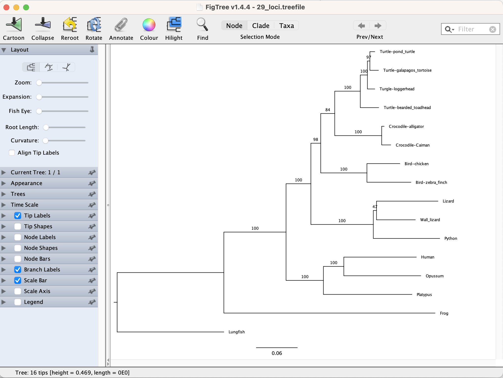

# **Introduction**

In many cases, researchers are interested in estimtaing trees of hundreds or thousands of loci at a time. This allows for much more robust estimates of things like species trees. It also allows us to examine the variation among the single locus trees, which can tell us a lot about things like ancestral population sizes, recombination, hybridisation, and introgression.

Analysing huge datasets is a bit beyond the scope of this practical, and would usually require either a lot of time or a lot of compute (or both). In this practical we'll replicate the basic idea by using IQ-TREE to analyse dataset of 29 genes.

As with the rest of the workshop, these 29 genes were put together to try and figure out the closest relatives of turtles. There are three placements of turtles that people have tended to recover in their phylogenetic analyses:


The paper from which we have taken the 29 loci used in this study is by Chiari et al, and was published in 2012 (<https://doi.org/10.1186/1741-7007-10-65>). Our 29 loci is roughly 10% of their original 248 gene dataset, but it's sufficient to replicate their results.

# **Getting set up**

Inside the `Workshop` folder on your computer, make a new folder called `IQTREE_phylogenomics`.

Now use your command line (terminal on Mac, Ubuntu on Windows) to navigate to that directory using the `cd` command.

An example on a Mac might look a bit like this:

```{bash, eval=FALSE}
cd /Users/rob/Documents/Workshop/IQTREE_phylogenomics 
```

and on Windows it might look like this

```{bash, eval=FALSE}
cd /mnt/c/Users/rob/Documents/Workshop/IQTREE_phylogenomics
```

Finally, copy the alignments of the 29 loci from the `raw_data` folder into this folder. You can do this as you usually would on your computer, by just copying the `29_loci` folder from the `raw_data` folder into the `IQTREE_phylogenomics` folder.

Once you're done you should be to check that the files are there by using the `ls` command like this:

```{bash, eval=FALSE}
ls -lh 29_loci/
```

You should see something like this:

```         
total 600
-rw-r--r--@ 1 rob   9.4K 15 Sep 09:00 turtle_ENSGALG00000000223.macse_DNA_gb-out.fasta
-rw-r--r--@ 1 rob   5.3K 15 Sep 09:00 turtle_ENSGALG00000001529.macse_DNA_gb-out.fasta
-rw-r--r--@ 1 rob   6.8K 15 Sep 09:00 turtle_ENSGALG00000002002.macse_DNA_gb-out.fasta
-rw-r--r--@ 1 rob    10K 15 Sep 09:00 turtle_ENSGALG00000002514.macse_DNA_gb-out.fasta
-rw-r--r--@ 1 rob    15K 15 Sep 09:00 turtle_ENSGALG00000003337.macse_DNA_gb-out.fasta
-rw-r--r--@ 1 rob    12K 15 Sep 09:00 turtle_ENSGALG00000003700.macse_DNA_gb-out.fasta
-rw-r--r--@ 1 rob    15K 15 Sep 09:00 turtle_ENSGALG00000003702.macse_DNA_gb-out.fasta
-rw-r--r--@ 1 rob   5.9K 15 Sep 09:00 turtle_ENSGALG00000003907.macse_DNA_gb-out.fasta
-rw-r--r--@ 1 rob   7.0K 15 Sep 09:00 turtle_ENSGALG00000005820.macse_DNA_gb-out.fasta
-rw-r--r--@ 1 rob    11K 15 Sep 09:00 turtle_ENSGALG00000005834.macse_DNA_gb-out.fasta
-rw-r--r--@ 1 rob   7.5K 15 Sep 09:00 turtle_ENSGALG00000005902.macse_DNA_gb-out.fasta
-rw-r--r--@ 1 rob   9.6K 15 Sep 09:00 turtle_ENSGALG00000008338.macse_DNA_gb-out.fasta
-rw-r--r--@ 1 rob   6.0K 15 Sep 09:00 turtle_ENSGALG00000008517.macse_DNA_gb-out.fasta
-rw-r--r--@ 1 rob   6.7K 15 Sep 09:00 turtle_ENSGALG00000008916.macse_DNA_gb-out.fasta
-rw-r--r--@ 1 rob    10K 15 Sep 09:00 turtle_ENSGALG00000009085.macse_DNA_gb-out.fasta
-rw-r--r--@ 1 rob   7.9K 15 Sep 09:00 turtle_ENSGALG00000009879.macse_DNA_gb-out.fasta
-rw-r--r--@ 1 rob   8.1K 15 Sep 09:00 turtle_ENSGALG00000011323.macse_DNA_gb-out.fasta
-rw-r--r--@ 1 rob   4.6K 15 Sep 09:00 turtle_ENSGALG00000011434.macse_DNA_gb-out.fasta
-rw-r--r--@ 1 rob    12K 15 Sep 09:00 turtle_ENSGALG00000011917.macse_DNA_gb-out.fasta
-rw-r--r--@ 1 rob   4.8K 15 Sep 09:00 turtle_ENSGALG00000011966.macse_DNA_gb-out.fasta
-rw-r--r--@ 1 rob   9.9K 15 Sep 09:00 turtle_ENSGALG00000012244.macse_DNA_gb-out.fasta
-rw-r--r--@ 1 rob   6.9K 15 Sep 09:00 turtle_ENSGALG00000012379.macse_DNA_gb-out.fasta
-rw-r--r--@ 1 rob   5.7K 15 Sep 09:00 turtle_ENSGALG00000012568.macse_DNA_gb-out.fasta
-rw-r--r--@ 1 rob    13K 15 Sep 09:00 turtle_ENSGALG00000013227.macse_DNA_gb-out.fasta
-rw-r--r--@ 1 rob   6.2K 15 Sep 09:00 turtle_ENSGALG00000014038.macse_DNA_gb-out.fasta
-rw-r--r--@ 1 rob   4.5K 15 Sep 09:00 turtle_ENSGALG00000014648.macse_DNA_gb-out.fasta
-rw-r--r--@ 1 rob   6.0K 15 Sep 09:00 turtle_ENSGALG00000015326.macse_DNA_gb-out.fasta
-rw-r--r--@ 1 rob   7.2K 15 Sep 09:00 turtle_ENSGALG00000015397.macse_DNA_gb-out.fasta
-rw-r--r--@ 1 rob   8.9K 15 Sep 09:00 turtle_ENSGALG00000016241.macse_DNA_gb-out.fasta
```

# **Check the alignments visually**

Drag and drop the folder `29_loci` into Geneious. Spend a minute or two looking through the alignments, and check for any obvious errors.

There are 16 total species in this analysis. If you scan through the alignments, do any contain all 16 species? (The `# sequences` column in Geneious helps here!).

You should notice that there isn't a single locus that includes all of the species. That's normal. Where data is missing, Maximum Likelihood will ignore the missing taxa. By comparing 29 loci, we can estimate a tree of all 16 species, even though there isn't a single locus which contains all 16 taxa.

In this case, there isn't time to edit the alignments, but it's worth thinking about whether you'd edit any of them if this were your data. Personally, I would remove a few parts here and there.

# **IQ-TREE with lots of loci**

In the interests of time, let's assume we're happy with the alignments as-is, and build some trees.

## A concatenated analysis

Now we'll use IQ-TREE to estimate a tree all 29 of our alignments at once.

To do this, we can run IQ-TREE on the folder of 29 alignments as follows. Get this running, and then read more about what is happening while it runs:

> Note: on Windows you only need to run the second line. The first line deals with a problem specific to Macs, because Macs add annoying hidden files!

```{bash, eval=FALSE}
rm 29_loci/.DS_store
iqtree -s 29_loci -bb 1000
```

Breaking down the IQ-TREE command:

-   `-s` tells IQ-TREE that you have a folder of alignments, and that you want IQ-TREE to concatenate all of them together into one long alignment, then treat them as one long locus (i.e. fit a single model to all the sites together).
    -   This is the same command we used when we had a single alignment
-   `-bb 1000` tells IQ-TREE to do 1000 ultrafast bootstraps. We use ultrafast bootstraps here becuase they give us the same infomration, but a lot more quickly!
    -   Compare this to `-b` which we use to do the original bootstraps.

### Examining the .iqtree file

Examine the `29_loci.iqtree` file. Note that the best-fit model of evolution here is one of the most complex models we have for DNA sequences: `GTR+F+I+G4`. Breaking this down:

-   `GTR`: is the general time reversible model, in which we have independent rates of change between each pair of the four bases, A, C, T, and G.
-   `+F`: means we are estimating the base frequencies from the alignment
-   `+I`: means we are estimating an invariant sites parameter (roughly - this allows constant sites to be modelled as not changing over evolutionary time)
-   `+G4`: means we are estimating a gamma distributed rates with four categories (this allows some sites to evolve slowly, and some more quickly).

The actual parameters for each of these parts of the model are described in the `SUBSTITUTION PROCESS` section. It's worth familiarising yourself with this, because extreme parameter values can sometimes highlight issues with your data. (Here there aren't any extreme values).

### Examining tree file

Load the tree file (`29_loci.treefile`) FigTree. Root it with the Lungfish, order the nodes, and then add the bootstraps to the branches. Your tree should look like this:




### Questions

Which hypothesis does this tree suggest is true for the placement of turtles? 

What is the bootstrap support for this placement?


<details>
  <summary><strong>Reveal answer</strong></summary>

**Hypothesis:** Turtles are sister to crocodiles

**Bootstrap support:** 84%

</details>

## Adding gene concordance factors

Knowing the bootstrap value is useful. It's even more useful if we can also know what proportion of our 29 loci actually supported the answer. This number is called a `gene concordance factor`. To add those to our tree, we'll need to calculate trees for all the 29 loci, then see how many of them support the (crocodile + turtle) grouping.

To do that, we'll first compute a tree for every one of the 29 loci. The command below runs a full IQ-TREE analysis on each of the 29 loci independently, generating 29 independent trees.

```{bash, eval=FALSE}
iqtree -S 29_loci --prefix loci
```

Let's break that down:

* `-S 29_loci`: tells IQ-TREE to build a separate tree for every alignment in the `29_loci` folder.
    * Compare this to the small 's' we use to join them all together and get one tree above
* `--prefix loci`: adds the prefix `loci` to all of the output files so we can keep track of what we're doing.

Next we need to calculate the gene concordance factors and add them to the tree we calculated above. IQ-TREE will do that for us with this command:

```{bash, eval=FALSE}
iqtree -t 29_loci.treefile --gcf loci.treefile --prefix concord
```

Breaking this down:

* `-t 29_loci.treefile`: tells IQ-TREE we want to add the gCf values to our existing maximum likelihood tree we calculated above
* `--gcf loci.treefile`: tells IQ-TREE to calculate gCF values from the `loci.treefile`, which contains a tree for each of the 29 individual loci
* `--prefix concord`: tells IQ-TREE to add the prefix `concord` to the output files

Now we can look at those gCF values by opening the `concord.cf.tree` file in FigTree, and going through the usual steps

* root the tree on the lungfish
* order the nodes
* add branch labels with the 'label'

Each branch should now have two numbers on it, separated by a slash. The first number is the bootstrap value we calculated above. The second is the gCF value.

### Questions

1. Examine your tree. What do you notice about the gene concordance factors (gCFs) in general?
2. What do you notice about the gCF for the branch that unites turtles and crocodiles?

<details>
  <summary><strong>Reveal answers</strong></summary>

**1. General gCF values:** they are mostly high, suggesting that most branches are supported by most of the gene trees

**2. gCF for (turtle + crocodile)** the gCF is 13.8%, suggesting that just 4 of our 29 loci actually have that branch in the single locus tree.
</details>

## Partitioned analysis

A branch with a low gCF value can be a cause for concern, particularly when the other gCF values are much higher. For some reason, the critical branch in our tree above has a gCF of just 13.8%, and this is much lower than all of the other branches. 

In this case, it turns out that the model of evolution we used was too simple. Above, we concantenated all of the loci and fit a single model to them. This makes the assumption that every site in every locus evolved under the same model, with the same set of branch lengths. In truth, different loci experience different patterns of evolution (and so might need different models), and evolve at very different rates (and so might need different overall rates of evolution).

So, a much more realistic model would be to allow the loci to have different models of evolution, and different overall _rates_ of evolution. We can do this with a partitioned analysis. 

Here we'll start by fitting separate models to all of the 29 loci, and then we'll use a model selection method to merge together partitions which seem to be best fit by the same patterns and rates of evolution (this is called the PartitionFinder algorithm). IQ-TREE makes all of this very simple.

Run the command below:

```{bash, eval=FALSE}
iqtree -p 29_loci -m MFP+MERGE -bb 1000 --prefix partitioned
```

While that runs, here's what those commands do:

* `-p 29_loci`: fits a model in which each partition (which is one or more loci) gets its own rate of evolution
* `-m MFP+MERGE`: chooses a best-fit model for each partition (`MFP` stands for ModelFinder Plus), and then uses the partitionfinder algorithm to figure out how best to merge together similar partitions (the `MERGE` part).
* `-bb 1000`: does 1000 ultrafast bootstraps
* `--prefix partitioned`: prefixes the output files with 'partitioned'

Before we go further, take a look at the `partitioned.iqtree` file. In the `ModelFinder` section you should see something like this (I removed most columns for clarity):

```
List of best-fit models per partition:

  ID  Model       
   1  TN+F+I+R2   
   2  GTR+F+I+G4  
   3  GTR+F+I+G4  
   4  TVM+I+G4    
   5  TIM2+F+G4   
   6  TN+G4       
   7  TN+F+G4     
   8  GTR+F+I+G4  
```

This tells you that IQ-TREE merged the initial 29 loci into just 8 partitions. And it also shows which model was selected for each partition (note that the models can have the same structure, e.g. three of the partitions above have the `GTR+F+I+G4` model; these models will have different parameter values in each partition though).

In the `SUBSTITUTION PROCESS` section you should see something like this (I've removed the model parameters for clarity):

```
ID  Model           Speed  
 1  TN+F+I+R2      1.2183  
 2  GTR+F+I+G4     0.8907  
 3  GTR+F+I+G4     1.1421  
 4  TVM+F+I+G4     1.5479  
 5  TIM2+F+G4      0.5938  
 6  TN+F+G4        0.7193  
 7  TN+F+G4        0.6514  
 8  GTR+F+I+G4     1.1512  
```

This tells you that the different partitions are evolving at quite different rates. The fastest partition (number 4)evolves about 1.5x faster than the average, and the slowest (number 5) evolves at about 0.6x the average. That's more than a 2-fold difference. 

### Is the partitioned or concatenated model better?

This is an important question (you'll see why in a minute). The analysis we've just done suggests that the partitioned model is better, because the concatenated (i.e. single-model) model we fit earlier is a special case of the partitioned model. In other words, if the concatenated model was best, what _should_ have happened is that the `MFP+MERGE` command would have merged all the loci into a single partition. It didn't do this, suggesting the partitioned model is better. 

We can also check this using information theory. The Bayesian Information Criterion (BIC) is a measure which helps us compare models. A lower score is better. 

If you scroll to the "MAXIMUM LIKELIHOOD TREE" section of the `partitioned.iqtree` file, and to the same section in the `29_loci.iqtree` file, you can find the lines which give the BIC for each analysis. 

In my analysis, BIC scores are:

* partitioned analysis: 232498.1814
* concatenated analysis: 232864.3277

The score for the partitioned analysis is lower by almost 400 units. This confirms that the partioned model is a better model.

### Adding gCF values to the partitioned tree

Before we look at the partitioned tree, let's add the gCF values as we did above. This is the same command we use above, but making the target tree (`-t`) the partitioned tree we just calculated:

```{bash, eval=FALSE}
iqtree -t partitioned.treefile --gcf loci.treefile --prefix concord_partitioned
```

### Examining the partitioned tree

Open up the partitioned tree with gCF values (`concord_partitioned.cf.tree`) in FigTree.

As always:

* root the tree on the lungfish
* order the nodes
* add branch labels with the 'label'

Examine the tree. 

1. What does it tell you? 
2. What are the key bootstrap and gCF values? 
3. Using this tree, would you reach different conclusions compared to using the concatenated tree above? 
4. What do you think is happening here? 
5. Which answer should you believe more, and why?

<details>
  <summary><strong>Reveal answers</strong></summary>

**1. What does it tell you?** turtles are sister to a (crocodile + bird) clade. 

**2. Bootstrap and gCF values** the bootstrap support is 100%, and the gCF is 37.9% (11 of our 29 loci contain this grouping). 

**3. Would you reach different conclusions?** Yes! You'd be reasonably sure that turtles are sister to a (crocodile + bird) clade.

**4. What is going on?** The only difference here is the model. The concatenated model gives us turtles as sister to crocs, with 84% bootstrap support and a gCF of 13.8%. The partitioned model gives us turtles as sister to (crocodiles + birds) with 100% bootstrap and 37.9% gCF.

**5. Which answer should we believe?** The BIC value of the partitioned model is substantially lower, so we should prefer this model, and therefore the answer given by this analysis. 
</details>


# **Finishing up**

This tutorial demonstrates the basics of using IQ-TREE on phylogenomic datasets. One thing it underlines is that models matter. Choosing a good model can make a huge difference to the answers you get! The argument about the closest relatives of turtles was larglely resolved in favour of the answer we get here: that turtles are sister to crocodiles. Choosing good phylogenetic models was a crucial part of getting this answer.

If you want to keep learning about phylogenomic analyses with IQ-TREE, here are some additional resources.

## Workshops and tutorials for IQ-TREE

If you want to keep learning, one option is to follow along with previous IQ-TREE workshops. 

For example, the recent Woods Hole workshop used the same dataset that we used here, but did some additional analyses to figure out what was driving the different models to recover different trees (spoiler alert: the dataset contains some paralogs...). You can find that workshop here: https://iqtree.github.io/workshop/molevol_tutorial2025

A full list of IQ-TREE workshops is available here: https://iqtree.github.io/workshop/

And the IQ-TREE documentation (https://iqtree.github.io/doc/) has beginner (https://iqtree.github.io/doc/Tutorial) and advanced (https://iqtree.github.io/doc/Advanced-Tutorial) tutorials, and recipes for more general types of analyses too (https://iqtree.github.io/doc/recipes/). 


## Concordance factors and vectors

Concordance factors and concordance vectors (which say things about branches that were _not_ in your tree) go further than we had time for here. The IQ-TREE docs contain specific pages for concordance factors (https://iqtree.github.io/doc/Concordance-Factor) and concordance vectors (https://iqtree.github.io/doc/recipes/concordance-vector). If you want more information on what all of these things mean, Matt Hahn and I wrote a review recently that tries to give an overview, here: 

Lanfear R. and Hahn M.W. (2024) *The Meaning and Measure of Concordance Factors in Phylogenomics*. Molecular Biology and Evolution, 41:msae214. https://doi.org/10.1093/molbev/msae214

## Ask us!

The whole IQ-TREE team and community can be contacted on the IQ-TREE discussion forum. It's a great place to ask for help or guidance, no matter whether you're a complete beginner or trying to push the boundaries:

https://github.com/orgs/iqtree/discussions

If you're a beginner, there's a reasonable chance that your question has been asked before, so it's worth searching hte discussions!
